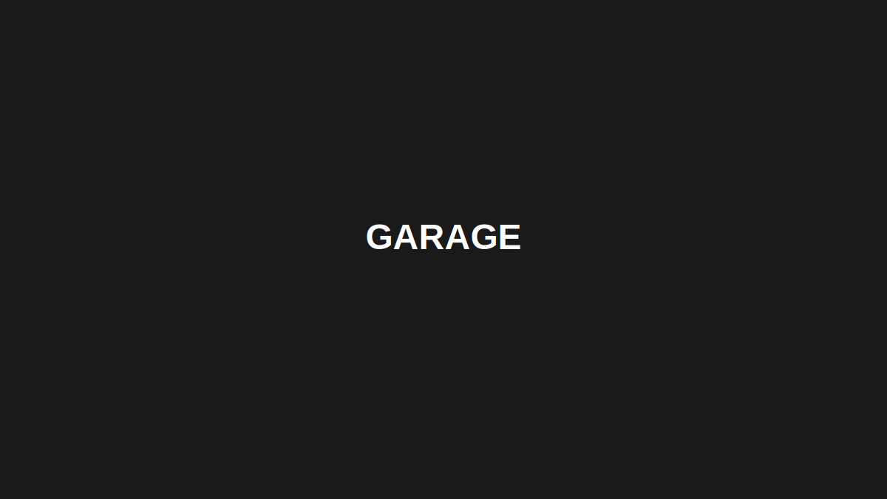
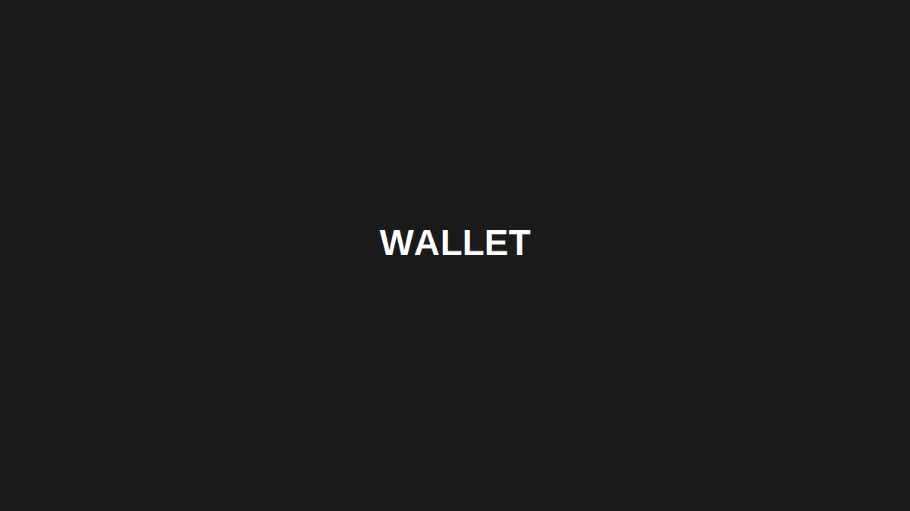

# Brechó Online

Um marketplace de moda sustentável onde você compra, vende e negocia roupas com uma moeda virtual própria chamada **VAT**. Você anúncia suas peças, recebe propostas, faz contrapropostas, negocia direto pelo chat e finaliza a compra de forma segura.

**Projeto acadêmico** - Sistemas de Informação, IFCE Crato, Disciplina: Projeto de Desenvolvimento Web I

[📽️ Apresentação do projeto](https://drive.google.com/file/d/1A_FM3ef1TIHqwlnPGgCzyd7jjFrh11vG/view?usp=sharing)

## Equipe

- Leonardo Lucena Pereira
- Larissa Kamily Cardoso de Melo
- José Adiel Calixto Serafim
- Luiz Felipe Carvalho Menezes
- Maria das Graças Rodrigues Luciano

## Screenshots








## Como Instalar e Rodar

Certifique-se de ter [Node.js](https://nodejs.org/) instalado.

```bash
# Instalar dependências
pnpm install

# Rodar em desenvolvimento
pnpm run dev

# Build para produção
pnpm run build
```

## Tecnologias

- React 19
- Vite 8
- React Router DOM 7
- localStorage (banco de dados local)
- CSS Vanilla
- Context API
- Lucide React (ícones)

## O que você pode fazer

**Autenticação**
- Criar conta e fazer login
- Perfil editável com avatar, telefone e endereço
- Contas de teste: `maria@demo.com` ou `joao@demo.com` (senha: `123456`)

**Anúncios**
- Criar, editar e deletar seus anúncios na Garagem
- Galeria com busca e filtros por categoria, tamanho, preço
- Visualizar detalhes do produto e do vendedor

**Negociações**
- Fazer propostas de compra nos anúncios
- Aceitar, recusar ou contrapropor ofertas
- Timeline visual do histórico de propostas

**Chat**
- Conversar com compradores e vendedores
- Mensagens em tempo real com leitura automática
- Widget flutuante para acesso rápido

**Carteira VAT**
- Comprar e resgatar VATs (moeda virtual)
- Ver histórico de transações
- Gráfico de evolução do saldo

**Extras**
- Layout responsivo (mobile, tablet, desktop)
- Modo escuro

