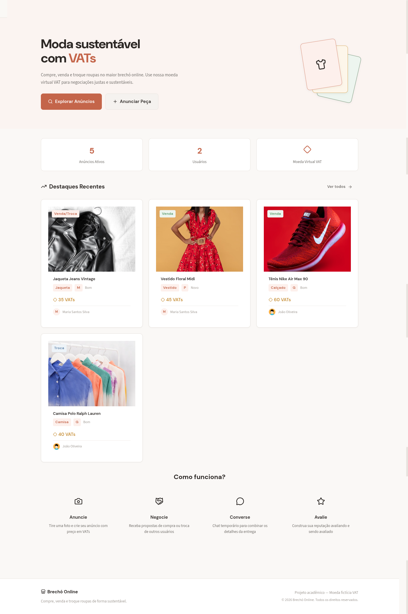
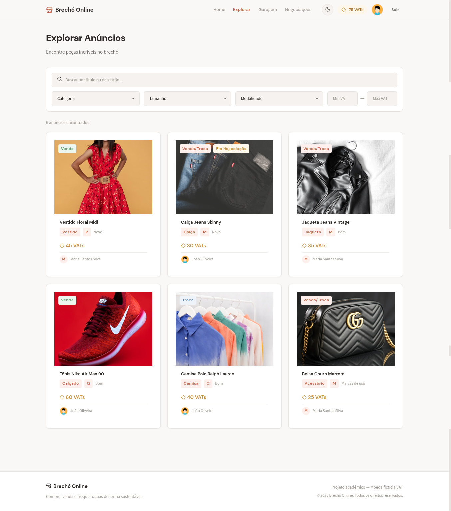
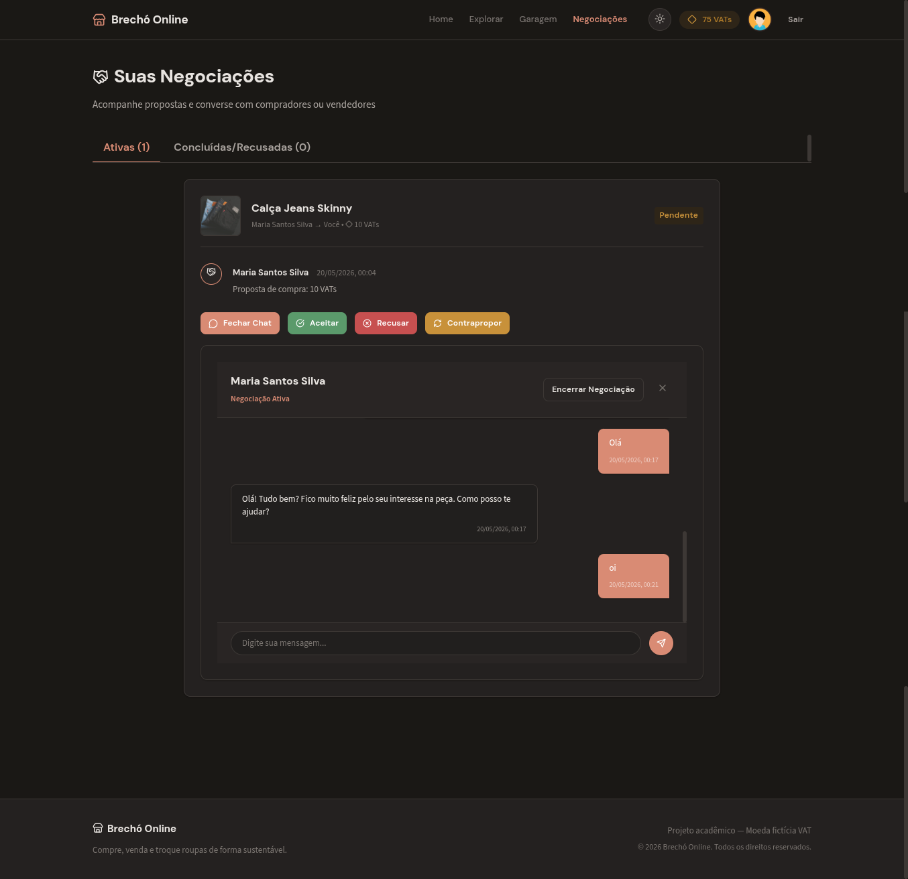
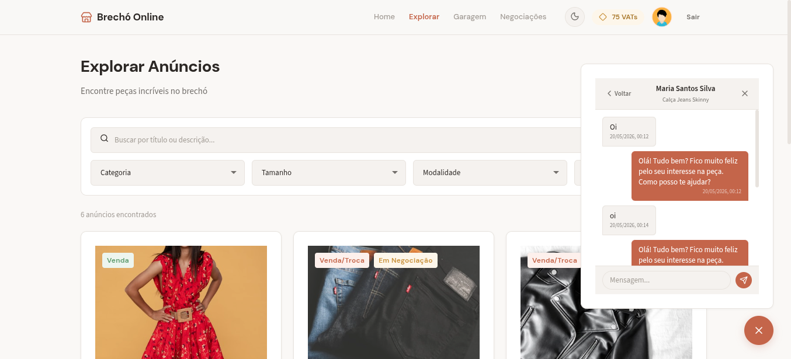
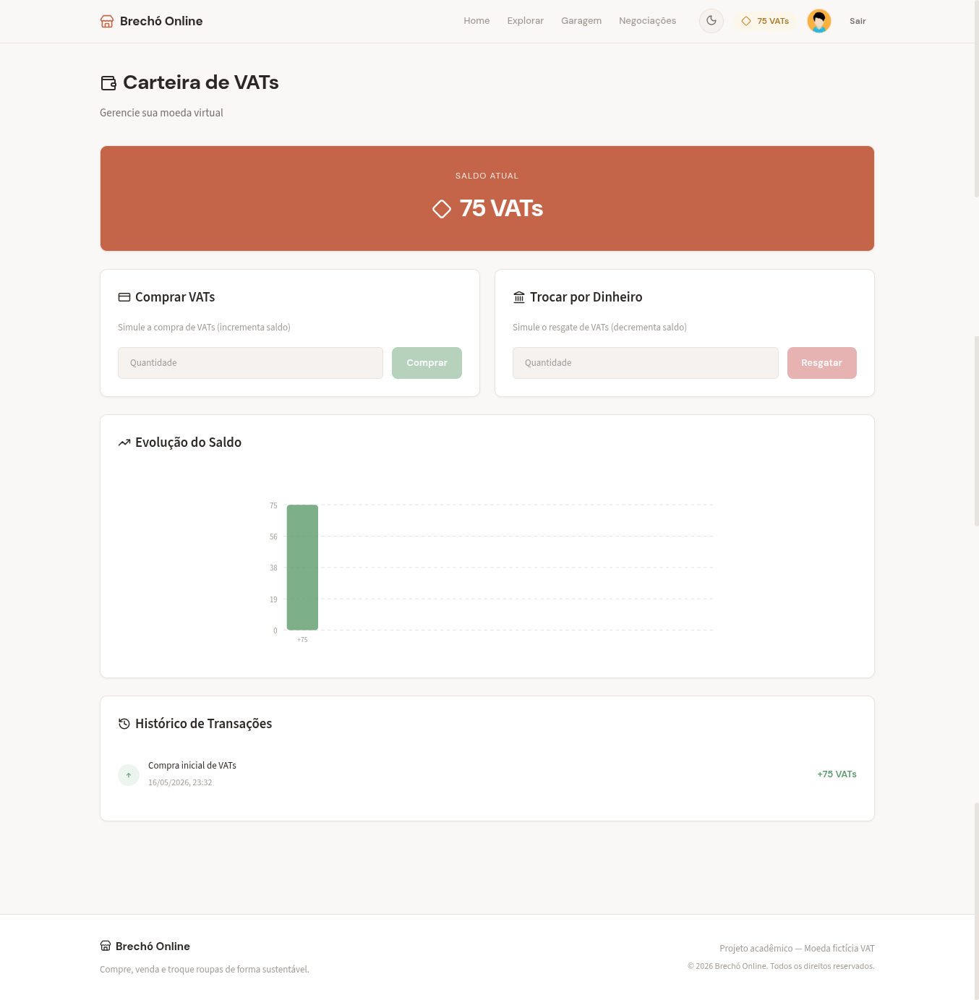
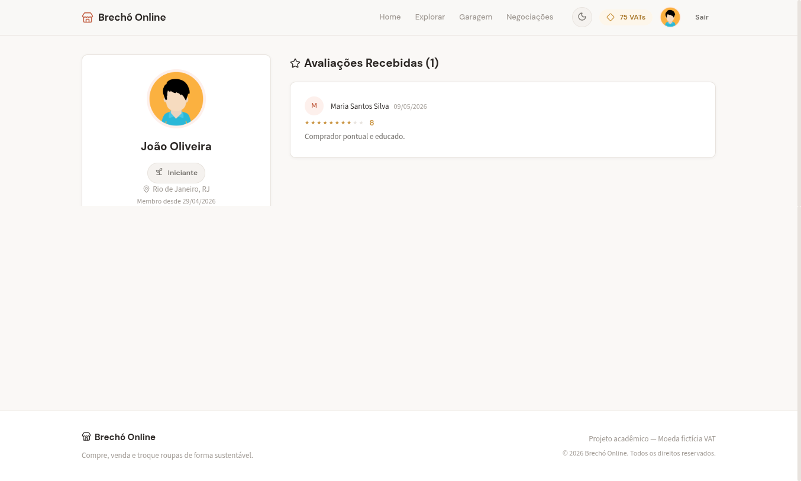

# 👗 Brechó Online (VATs)

Marketplace completo de moda sustentável baseado em uma moeda virtual própria (**VAT**). O sistema permite que usuários anunciem suas roupas, façam propostas de compra, negociem valores através de contrapropostas e conversem em tempo real para combinar a entrega.

> 🎓 **Projeto Acadêmico**  
> **Curso:** Sistemas de Informação  
> **Instituição:** IFCE - Campos Crato  
> **Disciplina:** Projeto de Desenvolvimento Web I

---

## 👥 Equipe 2 — Responsabilidades de Implementação

O desenvolvimento das novas funcionalidades e refatorações estéticas do Brechó Online foi dividido de maneira colaborativa entre os seguintes membros da **Equipe 2**:

*   **Leonardo Lucena Pereira**

*   **Larissa Kamily Cardoso de Melo**

*   **José Adiel Calixto Serafim**
   
*   **Luiz Felipe Carvalho Menezes**
   
*   **Maria das Graças Rodrigues Luciano**
   
---

## 📸 Telas Principais (Screenshots)

*Coloque as capturas de tela da sua aplicação dentro da pasta `public/screenshots/` ou adicione os links abaixo:*

### 🏠 1. Home (Landing Page)


### 📢 2. Galeria de Anúncios e Filtros


### 🤝 3. Painel de Negociações e Timeline de Propostas


### 💬 4. Conversas e Chat de Negociação



### 💰 5. Carteira Digital (VATs) e Gráfico de Evolução



### 💬 6. Perfil do Usuário


---

## 🎥 Vídeo de Demonstração

Assista ao vídeo explicativo com a apresentação do sistema e a demonstração prática das funcionalidades (fluxo de negociação, chat e transações):

[](https://www.youtube.com/watch?v=ID_DO_VIDEO)

*Clique na imagem acima para assistir ao vídeo no YouTube ou substitua pelo link real do seu vídeo de apresentação.*


---

## 🚀 Instalação e Execução

Para rodar o projeto localmente, certifique-se de ter o [Node.js](https://nodejs.org/) instalado em sua máquina.

```bash
# 1. Instalar as dependências do projeto (Recomendado pnpm ou npm)
pnpm install
# ou
npm install

# 2. Iniciar o servidor de desenvolvimento
pnpm run dev
# ou
npm run dev

# 3. Gerar o build de produção (para hospedagem/deploy estático)
pnpm run build
```

---

## 🛠️ Stack Técnica

| Tecnologia | Uso |
|---|---|
| **React 19** | Biblioteca de componentização e reatividade de UI |
| **Vite 8** | Ferramenta de build rápida e dev server |
| **React Router DOM 7** | Roteamento dinâmico SPA |
| **localStorage** | Persistência local de dados (simulação de banco de dados) |
| **Vanilla CSS** | Sistema de design personalizado com tokens CSS customizados |
| **Context API** | Estado global e sincronização de dados entre componentes |
| **Lucide React** | Conjunto moderno de ícones vetoriais responsivos |

---

## ✅ Funcionalidades Implementadas

### 🔐 1. Autenticação e Perfil do Usuário `[Obrigatória]`
- Login e Cadastro funcional (sem envio real de e-mail).
- Sessão persistida no `localStorage`.
- Perfil editável completo (nome, e-mail, telefone, endereço, avatar).
- Contas demo integradas para testes rápidos: `maria@demo.com` / `joao@demo.com` (senha: `123456`).

### 📢 2. CRUD Completo de Anúncios `[Obrigatória]`
- Criação, edição e exclusão de anúncios próprios na "Minha Garagem".
- Atribuição de categoria, tamanho, estado de conservação, preço em VATs e foto do anúncio.
- Galeria de anúncios com barra de busca com debounce e filtros combinados (categoria, tamanho, preço, etc.).

### 💰 3. Carteira Virtual VAT `[Obrigatória]`
- Moeda virtual própria (VAT) usada em todas as transações.
- Compra simulada de VATs e resgate (troca por dinheiro).
- Histórico de transações de crédito e débito detalhado.
- **Gráfico de Evolução SVG `[Opcional]`** exibindo o fluxo financeiro em barras animadas.

### 🤝 4. Sistema de Propostas e Negociação Dinâmico `[Obrigatória]`
- Criação de propostas de compra/troca informando o valor oferecido em VATs.
- Painel do anunciante (Painel de Negociações) para Aceitar, Recusar ou Contrapropor propostas.
- **Linha do Tempo Visual (Timeline) `[Opcional]`** detalhando o histórico completo de propostas e eventos da negociação.
- Transferência segura e automática de saldo VAT entre carteiras ao aceitar uma proposta.

### 💬 5. Chat Privado de Negociação `[Obrigatória]`
- Canal de mensagens criado automaticamente quando a proposta é iniciada.
- Mensagens de texto dinâmicas com timestamps de hora/data.
- **Controle de leitura inteligente `[Opcional]`** com badges reativos exibindo mensagens não lidas.
- **Widget de Chat Flutuante `[Opcional]`** persistente no rodapé da página para acesso rápido e instantâneo, com auto-ocultação inteligente na página principal de negociações para evitar redundâncias.

### 📱 6. Layout Totalmente Responsivo e Modo Escuro `[Opcional]`
- Adaptação completa para desktop (1024px+), tablets e dispositivos móveis (375px+).
- **Modo Escuro (Dark Mode) `[Opcional]`** nativo, persistido no navegador, com alternância de paleta de cores.
- **Paleta Boutique Terracota `[Opcional]`** com tons harmoniosos, sombras elegantes e micro-interações táteis nos botões.

